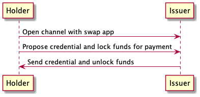

# Credential Swap Protocol

This document describes a protocol for swapping a credential against a payment.
The protocol features two participants, the credential holder and the credential issuer. The protocol guarantees that the credential holder receives the credential if and only if that payment is made to the credential issuer.



The protocol will run in a Perun channel and be based on the following state transition logic.

```
func validTransition(cur, next State) {
    // Decode the credential request.
    holder, issuer, docHash, price := DecodeOffer(cur.data)

    // Decode the credential request response.
    sig := DecodeCertificate(next.data)
    
    // Require that the issued signature is valid for the requested issuer and document.
    require(verifySig(docHash, sig, issuer))

    // Ensure that the amount determined by `price` is deducted from the holder's balance and added to the issuer's balance.
    require(next.funds[holder] = cur.funds[holder] - price)
    require(next.funds[issuer] = cur.funds[issuer] + price)
}
```

## Dispute case analysis

### Issuer denies channel opening


**Dispute resolution:** No funds have been locked into the channel yet. Nothing to resolve.

### Issuer denies credential request


**Dispute resolution:** The holder has locked funds into the channel but the issuer denies the service. To claim the locked channel funds, the holder can request channel settlement by the smart contract.

### Holder denies payment


**Dispute resolution:** The issuer has provided the credential but the holder denies to release the locked funds for the payment. To claim the funds, the issuer can request dispute resolution by the smart contract.

